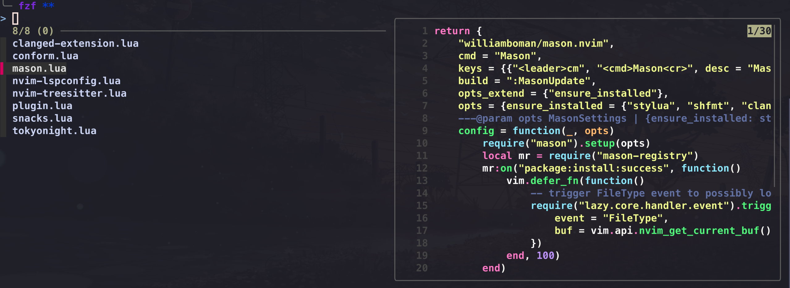
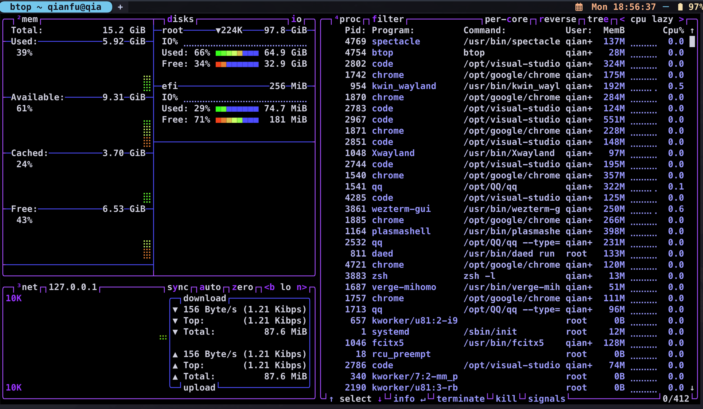
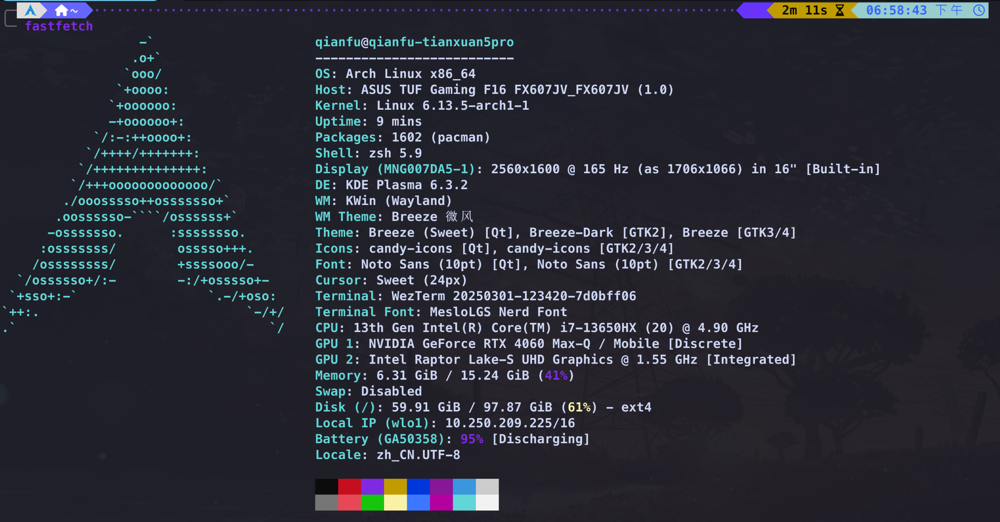

# 个人配置

我的操作系统是 Arch Linux，你可以根据自己的操作系统安装以下软件。

## zsh

zsh 是一个非常出色的 shell，拥有精美的主题和实用的插件，比 bash 强大很多。我的插件管理器是 zinit，它的 Turbo 模式启动速度很快（我很喜欢这个功能 😊）。

### theme

安装完成后，你首先需要选择一个主题。我推荐使用 [powerlevel10k](https://github.com/romkatv/powerlevel10k)，这是一个非常漂亮且功能丰富的主题。
在我的 powerlevel10k 配置文件中，我调整了背景颜色和提示符的颜色，使其更加美观。


### plugin and other configurations

**Zsh** 拥有丰富的插件，这些插件可以提升你的工作速度。

* zsh-autosuggestions：这个插件会根据你的历史记录为你提供建议。
* zsh-syntax-highlighting：这个插件会高亮你的命令语法（你可以在配置文件中调整颜色）。
* zsh-vi-mode：如果你是 Vim 用户，这个插件可以让你在 zsh 中使用 Vim 模式。
* oh my zsh：如果你想使用 oh-my-zsh 插件，可以在 .zshrc 文件中写入以下命令：

```shell
zinit snippet OMZP:: PluginName
```

* command aliasing

你可以在 .zshrc 文件中为一些命令设置别名，例如：

```shell
alias c="clear"
```

* Built-in features of Zsh

```shell
setopt autocd # Change directory automatically
setopt correct # Correct errors automatically```
```

* zsh-history

```shell
HISTSIZE=10000  #The maximum number of history records
HISTFILE=~/.zsh_history
SAVEHIST=$HISTSIZE  
HISTDUP=erase #Erase the duplicate history records
setopt appendhistory 
setopt sharehistory #Share your jistory records in other shell

setopt hist_ignore_space

setopt hist_ignore_all_dups # Ignore the duplicate records
setopt hist_ignore_dups  

setopt hist_save_no_dups # Do not restore the duplicate records
setopt hist_find_no_dups # Do not search for duplicate records.
```

### environment variables

```shell
export EDITOR=code       
export VISUAL=code      
export SUDO_EDITOR=code #  set Visual Studio Code as the default editor
export TERMINAL=wezterm # set Visual Studion Code as the default terminal
export FCEDIT=code       
```

## Small terminal tools

### fzf

```shell
eval "$(fzf --zsh)"
export FZF_DEFAULT_COMMAND="fd --hidden --strip-cwd-prefix --exclude .git" #显示隐藏文件,同时排除gitignore所忽略的文件
export FZF_CTRL_T_COMMAND="$FZF_DEFAULT_COMMAND"  # ctrl+t 启动fzf
export FZF_ALT_C_COMMAND="fd --type=d --hidden --strip-cwd-prefix --exclude .git"
export FZF_CTRL_T_OPTS="--preview 'bat -n --color=always --line-range :500 {}'" #shortcut=CTRL+T,and limit the preview to the first 500 lines
export FZF_ALT_C_OPTS="--preview 'eza --tree --color=always{} | head -200'" #alt+t预览文件内容_fzf
_fzf_comprun(){
  local command=$1
  shift

  case "$command" in #设置预览命令,通过一个switch case语句来区分不同的命令
  cd)           fzf --preview 'eza --tree --color=always {}|head -200' "$@" ;; #会以树状结构展示文件
  export|unset) fzf --preveiw "eval 'echo \$' {}"                       "$@" ;;
  ssh)          fzf --preview 'dig {}'                                  "$@" ;;
  *)            fzf --preview "--preview 'bat -n --color=always --line-range :500 {}'" "$@" ;;
  esac
}
_fzf_compgen_path(){
  fd --hidden --exclude .git . "$1" 
}
_fzf_compgen_dir(){
  fd --type=d --hidden --exclude .git . "$1" #自动补全文件路径
}
```

### bat (better cat)

[bat](https://github.com/sharkdp/bat) 可以在终端中显示文件内容，并支持语法高亮，你可以设置主题。

```shell
export BAT_THEME="Dracula" #set theme
```

**fzf with bat**



### zoxide (better cd)

[zoxide](https://github.com/ajeetdsouza/zoxide)

```shell
eval "$(zoxide init zsh)"
alias cd="z" #alias cd to z
```

### eza (better ls)

[eza](https://github.com/eza-community/eza)

### thefuck

[thefuck](https://github.com/nvbn/thefuck)
会自动纠正你之前输入的错误命令。例如，如果你输入了 par thefuck（正确的命令是 paru thefuck），thefuck 会在你输入 fk 或 thefuck 命令后自动纠正它。

```shell
eval $(thefuck --alias)
eval $(thefuck --alias fk) #alias fk to thefuck
```

### btop

[btop](https://github.com/aristocratos/btop)

Btop 可以在终端中查看电脑的内存使用情况。 



### speedtest

[speedtest](https://github.com/sivel/speedtest-cli)

Speedtest 可以在终端中检查你的网络速度.

### ncdu

[ncdu](https://dev.yorhel.nl/ncdu)

ncdu 可以在终端中检查磁盘使用情况.

### fastfetch

[fastfetch](https://github.com/LinusDietrich/fastfetch)

fastfetch 可以以一种很酷的方式在终端中显示你的系统信息.


