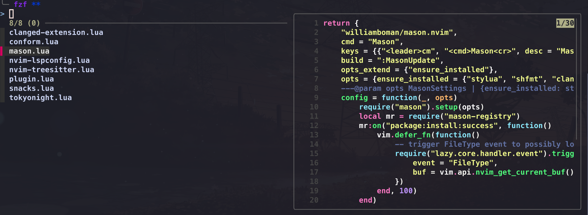
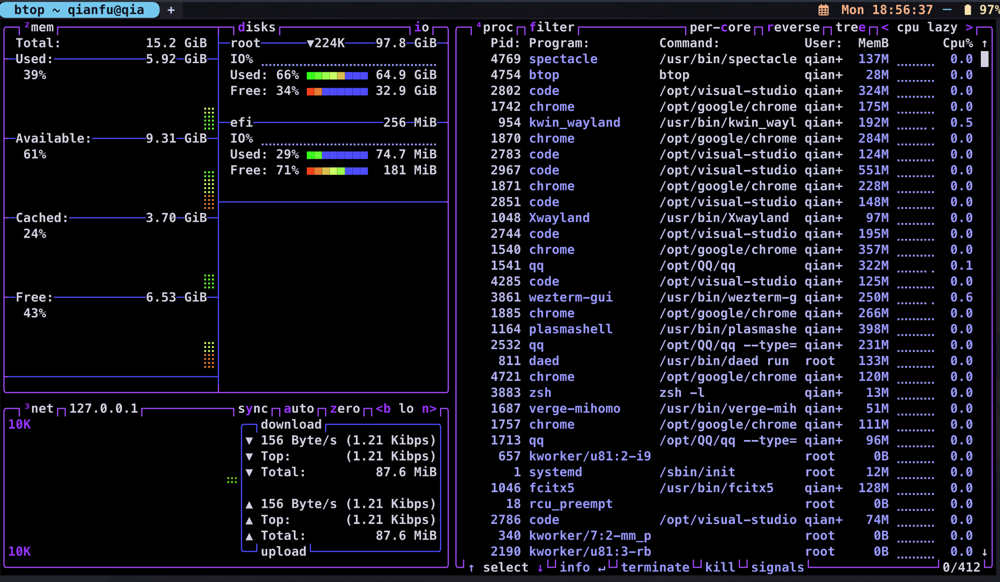
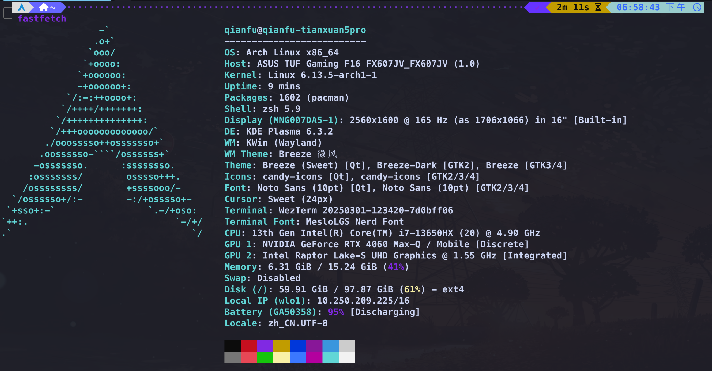

[中文版](README-zh.md)

# Personal Configuration

My Operating System is arch linux and you can install the following software based on your operating system.


## zsh
zsh is a wonderful shell with beautiful themes and useful plugins. It is much better than bash.
And my plugin manmager is zinit whose turbo model is fast and powerful(I love it :smile:).

### theme 
After installing ,what you want to do first is to choose a theme.I recommend you to use [powerlevel10k](https://github.com/romkatv/powerlevel10k) which is a very beautiful theme and has many features.

In my powerlevel10k configuration file, I change the background color and the color of the prompt to make it more beautiful.


### plugin and other configurations

**Zsh** has rich plugins which will improve your workflow .

* zsh-autosuggestions : This plugin will show you the suggestions based on your history.
* zsh-syntax-highlighting : This plugin will highlight the syntax of your command. (you can change the color in the configuration file)
* zsh-vi-mode : This plugin will let you use vim mode in zsh if you are a vim user.
* oh my zsh : If you want to use oh-my-zsh plugin, you can write the following commands into the .zshrc file

```shell
zinit snippet OMZP:: PluginName
```

* command aliasing

you can alias some command in the .zshrc file like this

```shell
alias c="clear"
```

* Built-in features of Zsh

```shell 
setopt autocd # Change directory automatically
setopt correct # Correct errors automatically```
```

* zsh-history

```shell
HISTSIZE=10000  #The maximum number of history records
HISTFILE=~/.zsh_history
SAVEHIST=$HISTSIZE  
HISTDUP=erase #Erase the duplicate history records
setopt appendhistory 
setopt sharehistory #Share your jistory records in other shell

setopt hist_ignore_space

setopt hist_ignore_all_dups # Ignore the duplicate records
setopt hist_ignore_dups  

setopt hist_save_no_dups # Do not restore the duplicate records
setopt hist_find_no_dups # Do not search for duplicate records.
```
### environment variables

```shell
export EDITOR=code       
export VISUAL=code      
export SUDO_EDITOR=code #  set Visual Studio Code as the default editor
export TERMINAL=wezterm # set Visual Studion Code as the default terminal
export FCEDIT=code       
```

## Small terminal tools

### fzf

```shell
eval "$(fzf --zsh)"
export FZF_DEFAULT_COMMAND="fd --hidden --strip-cwd-prefix --exclude .git" #显示隐藏文件,同时排除gitignore所忽略的文件
export FZF_CTRL_T_COMMAND="$FZF_DEFAULT_COMMAND"  # ctrl+t 启动fzf
export FZF_ALT_C_COMMAND="fd --type=d --hidden --strip-cwd-prefix --exclude .git"
export FZF_CTRL_T_OPTS="--preview 'bat -n --color=always --line-range :500 {}'" #shortcut=CTRL+T,and limit the preview to the first 500 lines
export FZF_ALT_C_OPTS="--preview 'eza --tree --color=always{} | head -200'" #alt+t预览文件内容_fzf
_fzf_comprun(){
  local command=$1
  shift

  case "$command" in #设置预览命令,通过一个switch case语句来区分不同的命令
  cd)           fzf --preview 'eza --tree --color=always {}|head -200' "$@" ;; #会以树状结构展示文件
  export|unset) fzf --preveiw "eval 'echo \$' {}"                       "$@" ;;
  ssh)          fzf --preview 'dig {}'                                  "$@" ;;
  *)            fzf --preview "--preview 'bat -n --color=always --line-range :500 {}'" "$@" ;;
  esac
}
_fzf_compgen_path(){
  fd --hidden --exclude .git . "$1" 
}
_fzf_compgen_dir(){
  fd --type=d --hidden --exclude .git . "$1" #自动补全文件路径
}
```

### bat (better cat)

[bat](https://github.com/sharkdp/bat) will display the contents of a file in the terminal,with syntax highlighting and you can set theme.

```shell
export BAT_THEME="Dracula" #set theme
```
**fzf with bat**



### zoxide (better cd)

[zoxide](https://github.com/ajeetdsouza/zoxide)

```shell
eval "$(zoxide init zsh)"
alias cd="z" #alias cd to z
```

### eza (better ls)

[eza](https://github.com/eza-community/eza)

### thefuck

[thefuck](https://github.com/nvbn/thefuck)
Thefuck will automatically correct your pervious wrong command.
For example,if you type 'par thefuck'(Correct command is 'paru thefuck'), thefuck will automatically correct it to 'paru thefuck' after typing 'fk' or 'thefuck' command.
```shell
eval $(thefuck --alias)
eval $(thefuck --alias fk) #alias fk to thefuck
```

### btop

[btop](https://github.com/aristocratos/btop)

Btop can check your computer's status in the terminal .



### speedtest

[speedtest](https://github.com/sivel/speedtest-cli)

Speedtest can check your internet speed in the terminal.

### ncdu

[ncdu](https://dev.yorhel.nl/ncdu)

ncdu can check the disk usage in the terminal.

### fastfetch

[fastfetch](https://github.com/LinusDietrich/fastfetch)

fastfetch can display your system information in the terminal in a fancy way.


